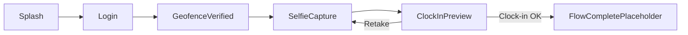

> **Repo copy:** This file is the product/frontend plan for the shared clock-in flow, maintained in-repo under `docs/`. Update it here when scope changes.

# SVB shared clock-in flow — five screens (all roles)

## Current scope (what we are building now)

**For this phase of work we are building only the five shared screens:** Splash, Login, Geofence verified, Selfie capture, Clock-in preview. These will eventually be used by Driver, Supervisor, and Engineer alike; **we are not** implementing per-role home screens, bottom navigation, job flows, or the rest of the ERP application until a later milestone.

**End of flow (this scope):** After the user taps **Clock-in** (stub or real API later), navigate to a **single lightweight placeholder** (e.g. “Clock-in complete”) **or** equivalent feedback, and **clear** the clock-in stack with `popUpTo` so Back does not return to login/selfie. The earlier plan’s three **role roots** remain the **long-term** target when the full app is in scope; they are **out of scope** for the current “five screens only” delivery.

## Delivery phases (five screens only)

| Phase | Name | Deliverable |
|-------|------|--------------|
| **P0** | Project shell | Android `app` module, Kotlin DSL, Compose BOM, M3, Navigation Compose, **Hilt** skeleton, `minSdk 26`, `@HiltAndroidApp`, `MainActivity`, packages: `data/`, `domain/`, `presentation/`, `ui/theme`, `di/`. App runs. |
| **P1** | SVB Field Ops theme | `Color.kt` / `Theme.kt` / `Type.kt` / `Shape.kt` per **Design system — SVB Field Ops** (Inter, P2 primary buttons 54×12dp, semantic colors). |
| **P2** | Five UIs + navigation | All **five** composables wired in order; fake `ViewModel` / state; Back stack + **Retake** → Selfie; geofence may use **static** copy; selfie may use **placeholder** until P3. |
| **P3** | Camera | `CAMERA` + **CameraX** preview and capture to `Uri`; preview screen uses **Coil**; Retake loop complete. |
| **P4** | Location (optional) | Fine location + **Fused** one-shot for geofence step, **or** stay mock until backend/rules exist. |
| **P5** | Backend wiring (later) | Retrofit + OkHttp + **kotlinx.serialization**, encrypted token storage, server-driven clock-in accept/reject; then re-introduce navigation to **real** role homes when that milestone starts. |

**Deferred (not part of “five screens only”):** Driver / Supervisor / Engineer **tab apps**, additional ERP screens, deep links, full analytics/CI—tracked when the product expands beyond this milestone.

## Design source (locked)

Reference image describes the **Login flow** used by **Driver, Supervisor, and Engineer**:

1. **Splash** — dark background, centered **SVB INFRA PROJECTS** wordmark (yellow), top-right small **profile** icon, bottom **Get Started** (yellow, dark text).
2. **Login** — white surface, **Welcome Back** + subtitle, circular avatar placeholder (yellow ring / person icon), **Employee ID** + **Unique Code** (masked) fields, primary **Login** button.
3. **Geofence verified** — white surface, concentric location graphic, **Location Verified!** (green) + body copy, detail card (**Site**, **Distance**, **Status: Verified**), **Continue to Clock-in**.
4. **Selfie capture** — dark camera UI, title **Shift Start Selfie**, back affordance, **circular** face guide + hint, shutter + flash control.
5. **Clock-in preview** — dark header strip with circular selfie, **Photo captured** green pill, read-only rows (**Date**, **Time**, **Location**, **Vehicle/Asset**), **Retake** (outlined) + **Clock-in** (green filled).

Screen layout details stay aligned with the **Login flow** reference PNG. **All colors, type, buttons, radii, and spacing** must follow the **SVB Field Ops** design system below (not the older approximate hex values from early mockups).

## Design system — SVB Field Ops (locked)

Authoritative spec for `ui/theme` (`Color.kt`, `Type.kt`, `Theme.kt`, `Shape.kt`). Design asset: workspace `assets/...ERP_App_Design_system-b3335000-f4a6-4282-b3ef-c2ed26c92c0c.png`.

### Colors (hex)

- **Core:** Black `#232323`, White `#FFFFFF`.
- **Primary (yellow / gold):** P1 `#F2B60B`, P2 `#FFDC00`, P3 `#FFCB4A`, P4 `#FFE29A`, P5 `#FFEDCD`.
- **Semantic:** Success `#47BB81`, Danger `#F64C4C`.
- **Neutral scale:** N1 `#1F1F1F`, N2 `#4B4B4B`, N3 `#8E8E8E`, N5 `#E1E1E1`, N7 `#F5F5F5` (use N4/N6 if needed later from full system).

**Compose / M3 mapping (baseline intent):**

- `primary` → **Primary 2** `#FFDC00` (solid primary buttons use this with **black** label text per spec).
- `onPrimary` → `#232323` (or pure black if contrast passes on P2).
- `primaryContainer` / `onPrimaryContainer` → tune using P3–P5 for chips, soft fills.
- `background` / `surface` / outlines → derive from **White**, **N7**, **N5**, **N2/N3** for borders and secondary text.
- `tertiary` or custom slot → **Primary 1** `#F2B60B` for accents if needed.
- `error` → Danger `#F64C4C`; success actions (Clock-in) map to **Success** `#47BB81` (use `Button` success style or `primary` slot overridden per screen — document in theme extension if M3 default `primary` stays yellow).

Splash / dark camera screens: use **N1** / `#232323` backgrounds as per Field Ops black + neutrals, not legacy `#212121` unless they match visually.

### Typography (Inter)

Load **Inter** via `androidx.compose.ui:ui-text-google-fonts` (or bundled font) and set `Typography` scale in `Type.kt`. Spec uses px; implement in **sp** / **TextStyle** with same relative hierarchy:

| Role | Size (spec) | Weight | Example / use |
|------|-------------|--------|-----------------|
| Timer | 36px | 800 | Large countdown |
| Page title | 28px | 800 | “Welcome Back” |
| Sub title | 20px | 600 | “Start Job” |
| Heading | 16px | 700 | “Scan Machine QR” |
| List item title | 15px | 600 | Rows |
| Button text | 14px | 800 | All primary CTAs |
| Subheading | 13px | 400 | Supporting lines |
| Section label | 12px | 800 | e.g. “ACTIONS” |
| Caption | 11px | 400 | Meta |

### Buttons

- **Height:** 54dp.
- **Corner radius:** 12dp (`RoundedCornerShape(12.dp)` or theme `ShapeDefaults`).
- **Primary:** fill **Primary 2** `#FFDC00`, text **black** `#232323`.
- **Success:** fill **Success** `#47BB81`, text **white**.
- **Danger:** fill **Danger** `#F64C4C`, text **white**.
- **Outline:** **White** surface, **light grey** border (N5), **black** text.

**Touch targets:** minimum **48dp** everywhere; **56dp** for the **primary CTA** when spec calls for larger tap (e.g. main Login / Clock-in).

### Icons

- **Set:** **Material Symbols Rounded**, **24dp** default grid.
- **Compose:** prefer **`material-icons-extended`** where glyphs exist; for symbols missing from the font, add **Material Symbols** variable font from Google Fonts or use SVG/vector assets. Document any gaps per screen.

### Layout and chrome

- **Design frame reference:** 375 × 812 (use as **mdpi design baseline**; implement with **WindowSizeClass** / flexible width on Android, not fixed iPhone width).
- **Corner radii tokens:** 8 / 12 / 16 / 20 / **9999** (full pill).
- **Bottom navigation (later):** height **80dp**, M3-style **pill indicator**.
- **Status bar:** treat **44dp** as design safe-area / top inset guidance when drawing custom headers (Android: `WindowInsets.statusBars` + content padding).

### Implementation checklist (theme milestone)

1. Define `SvbFieldOpsColors` object (or `Color` extensions) with literal tokens above.  
2. Build `lightColorScheme()` (and `darkColorScheme()` if product adds dark mode — Field Ops sheet is light-first; dark splash/camera are **surface** choices, not necessarily full M3 dark theme).  
3. Map `Button` / `FilledTonalButton` / `OutlinedButton` defaults via `SvbButtonTokens` or theme composition locals where M3 defaults diverge (54dp height, 12dp radius).  
4. Wire **Inter** as `fontFamily` for entire `Typography`.  
5. Replace any remaining references to **#FFC107 / #4CAF50 / #212121** from early login PNG notes with tokens from this section.

## Product rules (from thread + your answer)

- **Single Activity** + **Navigation Compose**.
- **Role fixed per login**; **no deep links** (unchanged for the full product; for **this scope** role is not surfaced after clock-in).
- **After Clock-in succeeds (full product):** go **straight to the correct role home/root** (no separate success page) and **popUpTo** clear the flow. **For the current “five screens only” scope:** use a **single placeholder** destination instead of role roots until Phase 6 / product expands.

## Final tech stack (locked)

Agreed industrial defaults for this app: Kotlin + Compose, shared five-screen clock-in flow, three fixed roles, no deep links in v1.

### Platform and language

- **Android** (phone-first; tablet support later if needed).
- **Kotlin**.
- **minSdk 26** (use **24** only if the fleet must support Android 7.x).

### UI

- **Jetpack Compose**.
- **Material 3** (`material3`) with **SVB Field Ops** tokens (see **Design system — SVB Field Ops**).
- **Icons:** Material Symbols Rounded (24dp); **`material-icons-extended`** plus font/asset fallback as needed.
- **Typography:** **Inter** (Google Fonts / bundled).

### Navigation and structure

- **Single `Activity`**.
- **Navigation Compose**: top-level `NavHost` + **nested** graph for the five-screen flow; **separate role roots** after successful clock-in.

### Architecture and DI

- **MVVM**: composables + `ViewModel` + `UiState` / `StateFlow` (or `MutableStateFlow` + expose read-only).
- **Dagger Hilt** for dependency injection (`@HiltAndroidApp`, `@AndroidEntryPoint`, `@HiltViewModel`, `@Module` / `@InstallIn`).

### Concurrency

- **Kotlin Coroutines** and **Flow**.

### Networking (when backend contracts exist)

- **Retrofit** + **OkHttp**.
- **kotlinx.serialization** for JSON, with the appropriate Retrofit converter.

### Media and device

- **CameraX** for selfie step: preview + still capture to **file / `Uri`**.
- **Coil** (`coil-compose`) to load the captured `Uri` on the preview screen.

### Location and geofence

- **Google Play services — Fused Location Provider** for **on-device UX** (fresh fix, accuracy hints, “likely in zone” before submit).
- **Server is the source of truth** for **authoritative clock-in** accept/reject: send coordinates, accuracy, timestamp, session/employee identifiers, and related metadata with the clock-in request; server applies polygon/rules and anti-abuse checks. Device-side logic is for responsiveness and messaging, not the final verdict alone.

### Persistence and security

- **DataStore** (Preferences) for **non-sensitive** app preferences.
- **Encrypted storage** for **access/refresh tokens and secrets** (not raw SharedPreferences). Pick concrete APIs at implementation time (e.g. Encrypted DataStore or AndroidX Security Crypto + Keystore-backed keys).

### Build and quality

- **Gradle Kotlin DSL**.
- **Compose BOM** to align Compose artifact versions.
- **Testing target:** JUnit + **Turbine** for Flow; **Compose UI tests** for critical flows; **MockWebServer** for HTTP once APIs are stable.

### Tooling

- **Cursor** for most Kotlin/Gradle editing; **Android Studio** for emulator, Logcat, Compose **Preview**, and profilers.

### Explicitly out of scope for v1 (unless product adds later)

- **Deep links**.
- **In-app role switching** (role fixed at login).
- **RxJava** (not part of a greenfield Compose stack).

## Navigation shape

- **Top-level `NavHost`**: `splash`, nested **`clock_in_flow`**. **Current scope:** add **`flow_complete`** (or similar) placeholder instead of **`driver_root` / `supervisor_root` / `engineer_root`**. **Future:** swap placeholder for role-specific roots when building the full app.
- **Nested `NavHost`** inside `clock_in_flow` for **Login → Geofence → Selfie → Preview** (Splash can start the graph or sit immediately before nested host—pick one place for `Get Started` → `login`).
- **Back**: system/gesture back should mirror stack (Preview → Selfie → Geofence → Login); Splash typically no “up” to auth until user proceeds.

## Suggested route IDs (stable strings)

- `splash`
- `clock_in/login`
- `clock_in/geofence`
- `clock_in/selfie`
- `clock_in/preview`
- `flow_complete` (placeholder for **current** five-screen-only scope)
- `main/driver`, `main/supervisor`, `main/engineer` (**future**; not in current scope)

## Implementation notes per screen

| Screen | Compose / M3 | Platform / data |
|--------|----------------|-----------------|
| Splash | `Surface` dark, `Text` logo styling, `FilledButton` Get Started, small `IconButton` top-end | Optional: read session; if already clocked in today + token valid, could skip to role root (product decision later) |
| Login | `OutlinedTextField` or filled per design, `VisualTransformation` for unique code | `ViewModel`: employeeId, password/code; validate → navigate to geofence; stub API ok for UI-first |
| Geofence | Success iconography, `Card` for site/distance/status | Location permission + fused location later; **for UI-first**, show static copy from VM or mock |
| Selfie | `AndroidView` / **CameraX** `PreviewView` in `Box` with circular clip, or placeholder until CameraX wired | `CAMERA` permission; capture → write `Uri` to VM / `SavedStateHandle`, navigate to preview |
| Preview | `AsyncImage`/`Image` from `Uri`, summary rows (`ListItem` or custom), `OutlinedButton` Retake, `Button` Clock-in | On Clock-in: stub success → **`flow_complete`** + `popUpTo(splash) { inclusive = true }` (**current scope**). **Future:** `navigate(roleRoot)` + same pop behavior. |

## Gradle / libraries (concrete checklist)

Align module dependencies with **Final tech stack** above. Typical artifacts by milestone:

- **Compose:** Compose BOM, `material3`, `activity-compose`, `lifecycle-runtime-compose`, `lifecycle-viewmodel-compose`, `navigation-compose`, `hilt-navigation-compose`.
- **Hilt:** Gradle plugin, `hilt-android`, KSP `hilt-compiler`.
- **Networking:** `retrofit`, `okhttp`, logging interceptor, `kotlinx-serialization-json`, Retrofit `converter-kotlinx-serialization` (or equivalent supported adapter).
- **Images:** `coil-compose`.
- **Camera:** `camera-core`, `camera-camera2`, `camera-lifecycle`, `camera-view`.
- **Location:** `play-services-location` when wiring fused location (UI-first milestone can mock geofence copy).
- **Persistence:** `datastore-preferences`; add chosen **encrypted** token solution when implementing auth persistence.

## Project baseline

- If this repository is still empty, create a standard **Empty Compose Activity** project and implement there.

## Development order (maps to delivery phases)

1. **P0** — Gradle + Hilt shell + `MainActivity`.  
2. **P1** — M3 theme (**Field Ops**).  
3. **P2** — `AppNavHost` + nested clock-in routes + **five** UIs + fake VM + placeholder after clock-in.  
4. **P3** — Permissions + CameraX + Coil on preview.  
5. **P4** — Fused location on geofence step (optional; mock OK for P2).  
6. **P5** — Real Login / Clock-in APIs + encrypted session; then replace placeholder with **role roots** when full app milestone starts.

## Out of scope for current milestone (“five screens only”)

- **Per-role** home screens, bottom navigation, job/report flows, and the rest of the ERP UI.  
- **Deep linking.**  
- **Three `NavHost` role graphs** until product expands scope (use **`flow_complete`** placeholder until then).
